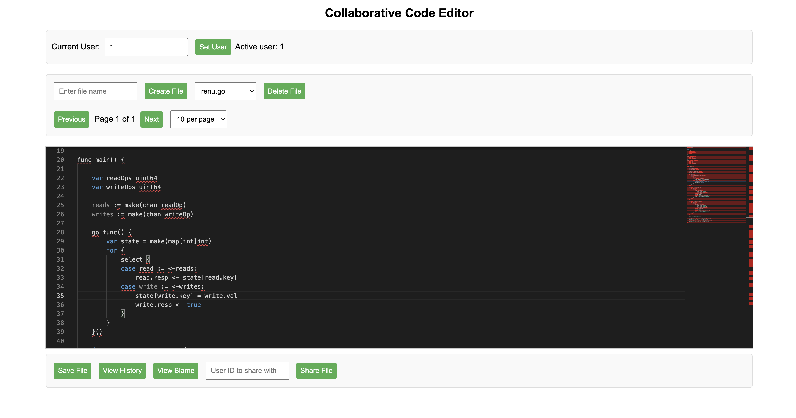

# collab-code-editor
A collaborative online code editor that allows users to create, edit, delete, and manage files

Run app

```bash
go run main.go
```

Run Test
```bash
go test -v ./...
```



Demo [Link](https://drive.google.com/file/d/1T0xoC2Q87QTpoPW0GYu8epAIqbKmeUM6/view?usp=sharing)
